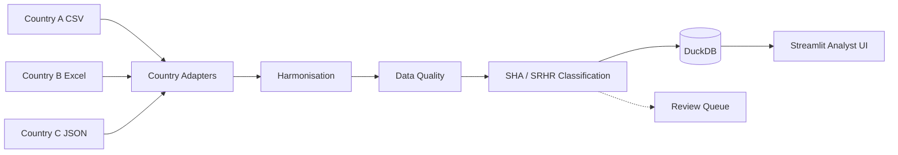

# Health Expenditure Harmonisation Prototype

Ingests three heterogeneous country expenditure extracts (CSV, Excel,
JSON) into one auditable DuckDB model, classifies each record against
SHA and SRHR reference codes, surfaces data quality issues, and gives
analysts a Streamlit review interface with full source lineage.

## Architecture



- `src/ingest.py`: per country adapters emitting records with full source
  lineage and parse level data quality issues.
- `src/harmonize.py`: canonical schema, record ids, content hashes; child
  splits excluded from totals to avoid double counting.
- `src/quality.py`: duplicate ids, adversarial text, label mismatch, orphans.
- `src/classify.py`: deterministic cascade: CoA map, sanitised keywords,
  review queue. SHA and SRHR resolved independently.
- `src/database.py`: DuckDB schema (transactions, classifications,
  dq_issues, ref tables, batches and files).
- `config/*.yaml`: all mapping logic lives outside the code so country
  teams can edit it.

## Setup and run

```bash
pip install -r requirements.txt
python -m src.pipeline        # creates schema and rebuilds output/harmonised.duckdb
streamlit run app.py          # analyst UI
python -m pytest tests/       # tests
```

## Dependencies and database

- Python 3.11+ with pandas, openpyxl, duckdb, streamlit, PyYAML, pytest
  (`requirements.txt`).
- Database: single DuckDB file at `output/harmonised.duckdb`. The schema
  DDL lives in `src/database.py` and is applied automatically by the
  pipeline on every run; no separate migration step. The file is
  disposable and is rebuilt from the raw extracts each time.

## Key assumptions

- Source files are immutable; raw files are the system of record.
- No FX rates were supplied, so amounts stay in their original currency
  (208 USD records flagged `non_primary_currency`, never converted).
- The simplified SHA reference has no capital formation code; capital
  expenditure (construction, ambulances) is routed to review, not forced.
- Source descriptions are untrusted data: adversarial text is flagged,
  sanitised for matching, and can never override CoA rules.

## Limitations and next steps

- No authentication; analyst "mark reviewed" writes back to DuckDB only.
- Fiscal year alignment across countries is labelled, not yet normalised
  into a single reporting period for cross country totals.
- Production: add FX tables, versioned mapping governance, a proper
  review workflow store, and optional AI assisted suggestions behind the
  same rule interface.
